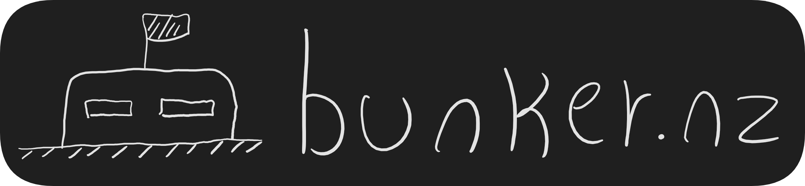



![Stage][b1]
[![License][b2]][l2]
[![Discord][b3]][l3]
[![Wiki][b4]][l4]
![Lines of code][b5]
![Contributors][b6]

[b1]: https://img.shields.io/badge/stage-pre--alpha-red
[b2]: https://img.shields.io/badge/License-MIT-green.svg
[l2]: https://github.com/opendevleague/bunkernz/blob/master/LICENSE
[b3]: https://img.shields.io/discord/85338836384628736.svg?logo=discord
[l3]: https://discord.gg/qmumDRD
[b4]: https://img.shields.io/badge/wiki-github-lightgrey
[l4]: https://github.com/opendevleague/bunkernz/wiki
[b5]: https://tokei.rs/b1/github/opendevleague/bunkernz?category=code
[b6]: https://img.shields.io/github/contributors/opendevleague/bunkernz?color=blue

## What is bunker.nz?
bunker.nz is an open-source multiplayer roguelike game made in Rust and compiled for Web Assembly.  
Visit the [wiki][l4] or join the discord server, [Game Dev League][l3], for information on how to contribute to the project.